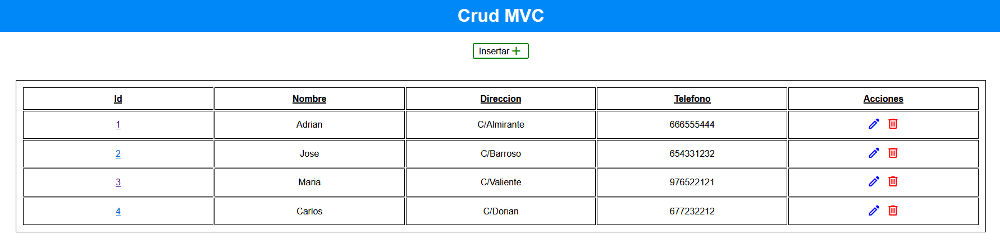

# CrudPHPMVC

This is a php project based on the MVC model.

## Table of contents

- [Description](#description)
- [Technologies](#technologies)
- [Installation](#installation)

## Description

This is a php project based on the MVC model.

In this project, the crud actions will be carried out through the MVC model. The crud actions consist of reading, displaying, editing, and deleting users.

## Technologies

The project has been created with:

- HTML
- CSS
- PHP > 7
- JS

## Installation

To run this project, we need the following steps:

- Download XAMPP at the following link: https://www.apachefriends.org/

- Open XAMPP control panel and turn on apache and mysql services.

- Go to your browser to the path of localhost/phpmyadmin and you will see the phpmyadmin database manager running.

- Once inside the phpmyadmin database manager, you have to click the import option. You must select the sql file, which is located in the bbdd folder of this project, which is the following: https://github.com/adri27info/CrudPHPMVC/blob/master/bbdd/crud_usuarios.sql

- Once the database is imported through the sql file, we go to the project path, which will be found in the path: http://localhost/CrudPHPMVC/index.php
